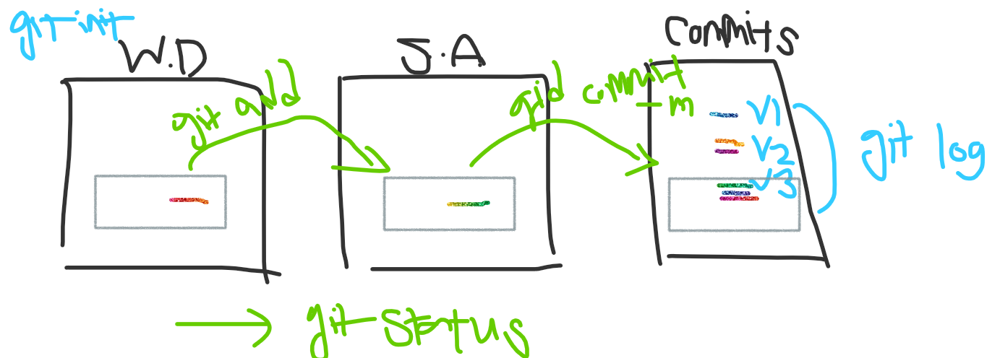

## 📑오늘 배운 것

### 1. CLI 기초

---

- GUI, CLI 차이

```bash
# 디렉토리 생성
mkdir 디렉토리명

# 디렉토리 이동
cd 디렉토리명

# 파일을 생성
touch 파일명

# 디렉토리 안 파일 조회
ls
ls -a (모든 파일)

# 제거, 삭제
rm 파일/디렉토리명
# rm -r 파일/디렉토리명 : 재귀적
# rm -rf 파일/디렉토리명 : 강제 삭제

# 파일, 폴더 이동 또는 이름 변경
mv 파일명 이동위치 폴더명 (없으면 이름 변경됨)

# 현재 경로 확인
pwd

# 창 화면 정리, 스크롤 올리기
clear
ctrl+l


```


### 2. 마크다운

---

- 문법: 

  # 제목

  ## 제목2
  ### 제목3
  #### 제목 4
  ##### 제목 5
  ###### 제목 6

  - *기울임*

  - **굵게**

  - <u>밑줄치기</u>

  - 인용: >, >>

    > Worry noting, go foward
    >
    > > Not push too much

  - `인라인 (한 줄 코드)`

  - 코드 블럭: ``` 입력후 언어 선택 (bash, cmd도 가능)

  ```python
  greeting = "Hello python"
  ```

  - 링크: `[표시할 텍스트](연결url)`

  - 이미지 삽입: ` 또는 assets으로 저장한거 사용 가능, 복붙`

  - 표 삽입: ctrl+t

    |      |      |      |
    | ---- | ---- | ---- |
    |      |      |      |
    |      |      |      |

### 3. GIT 기초

___

- 설치부터 명령어

  - 초기설정

    git config --global user.name "홍길동"

    git config --global user.email "gildong@gmail.com" ; 깃허브에서 사용

  - git init

    - 맨 처음 1회, 절대 홈 폴더에서 하지 않는다. (홈 폴더 多 데이터 과부하 방지)
    - git init한 폴더의 하위 폴더에서 절대 git init 하지 않는다

  - git add

  - git commit -m "메시지"

  - git status: 파일 상태를 확인

  - git log: 커밋 내역 확인

    - -- oneline: 한 줄 요약

    

- 커밋하는 과정 요약

  

  