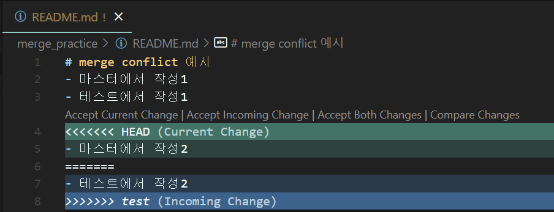
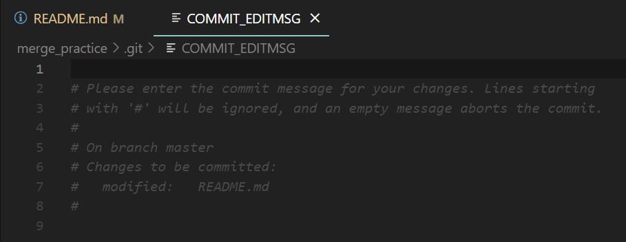

## 🔍 Git, Github (2) 


### 1. Branch 관리

- Branch? 메인 프로젝트의 세부 기능을 개발, 테스트를 위한 별도 공간

- 생성: git branch (branch name)

- 조회: git branch

  - 이때 활성화 된 branch가 색이 하이라이트 됨

- 이동: git switch (branch name)

- 삭제: git branch -d (branch name)

  - merge를 완료한 branch는 삭제해도 된다.

- 참고: branch에서 작성한 파일은 main과 다르게 버전 관리가 되는 거라서

  git switch (main branch name) 으로 가보면 업데이트가 안되는 것을 알 수 있음

```bash
xxxx@LAPTOP-1D76G707 MINGW64 ~
$ cd git_branch_practice

xxxx@LAPTOP-1D76G707 MINGW64 ~/git_branch_practice (master)
$ git add .

xxxx@LAPTOP-1D76G707 MINGW64 ~/git_branch_practice (master)
$ git commit -m "initial README.md-master"
[master 559bb5c] initial README.md-master      
 1 file changed, 2 insertions(+), 1 deletion(-)

xxxx@LAPTOP-1D76G707 MINGW64 ~/git_branch_practice (master)
$ git add .

xxxx@LAPTOP-1D76G707 MINGW64 ~/git_branch_practice (master)
$ git commit -m "update README.md-master"
[master 3bc3034] update README.md-master
 1 file changed, 2 insertions(+), 1 deletion(-)

xxxx@LAPTOP-1D76G707 MINGW64 ~/git_branch_practice (master)
$ git log --oneline
3bc3034 (HEAD -> master) update README.md-master
559bb5c initial README.md-master
e5aa6ef initial README.md -master

# branch 조회
xxxx@LAPTOP-1D76G707 MINGW64 ~/git_branch_practice (master)
$ git branch
* master

# branch 생성: (git branch 신규 브랜치 명)
xxxx@LAPTOP-1D76G707 MINGW64 ~/git_branch_practice (master)
$ git branch hotfix

# hotfix 브랜치로 이동
xxxx@LAPTOP-1D76G707 MINGW64 ~/git_branch_practice (master)
$ git switch hotfix
Switched to branch 'hotfix'

# 브랜치 생성 후 이동
xxxx@LAPTOP-1D76G707 MINGW64 ~/git_branch_practice (hotfix)
$ git switch -c 'test'

# 브랜치 삭제 (branch 옵션 -d 브랜치명)
# 브랜치 삭제 (branch 옵션 -D 브랜치명) 완전 삭제
xxxx@LAPTOP-1D76G707 MINGW64 ~/git_branch_practice (hotfix)
$ git branch -d test
Deleted branch test (was 69e05a9).

# 삭제된 것 확인
xxxx@LAPTOP-1D76G707 MINGW64 ~/git_branch_practice (hotfix)
$ git branch
* hotfix
  master

# master branch에서 b.txt 만들고, graph로 상태보기
xxxx@LAPTOP-1D76G707 MINGW64 ~/git_branch_practice (master)
$ git log --oneline --graph --all
* 05c477e (HEAD -> master) add b.txt-master
| * 69e05a9 (hotfix) update README.md-hotfix
|/
* 3bc3034 update README.md-master
* 559bb5c initial README.md-master
* e5aa6ef initial README.md -master

# 어디 부분 추가 되었는지 확인하고 싶을 때 (git diff 해쉬값1 해쉬값2; 변경 사항 디테일 확인)
xxxx@LAPTOP-1D76G707 MINGW64 ~/attraction (master)
$ git diff 3e2a8dc 709503d
diff --git a/README.md b/README.md
index b76f398..c7da8b6 100644
--- a/README.md
+++ b/README.md
@@ -1,3 +1,2 @@
# 놀이공원 어트랙션
-- 바이킹
-- 아틀란티스
\ No newline at end of file
+- 바이킹
\ No newline at end of file
```


___

### 2. Merge

- **Merge 의미**: 별도 생성한 branch 작업물을 메인 작업 공간에 병합하는 것

- merge 하기 전 메인 공간 경로인지 확인! 후 **git merge (병합하려는 branch)** 입력

- commit 내역 중 같은 위치에 다른 commit 내용이 있으면 충돌 발생

  아래와 같이 3가지 옵션이 있다.

> 1) Accept Current Change: 메인 브랜치의 파일 수정 사항으로 저장 하려면 클릭
> 2) Accept Incoming Change: `merge 하려는 브랜치`의 파일 수정 사항으로 저장 하려면 클릭
> 3) Accept Both Changes: 2개 모두 적용

- Compare Changes: 메인 브랜치 파일과 브랜치 작업 파일 수정사항 비교

- 위에서 말한 3가지 옵션 중 1개를 선택하고 add, commit 과정 재 진행

- 저장소 끝 `(master|MERGING)` 이 사라지고 "(master)"로 다시 나오면 merge conflict 해결 된 것

  




  ```bash
  # water branch 생성
  xxxx@LAPTOP-1D76G707 MINGW64 ~/attraction (master)
  $ git switch -c water
  Switched to a new branch 'water'
  
  # master에 water branch 합치기
  # git merge (합칠 브랜치 이름): 기준으로 가지고 있는 브랜치에서 명령어호출
  xxxx@LAPTOP-1D76G707 MINGW64 ~/attraction (master)
  $ git merge water
  Updating 30191be..17e9cd3
  Fast-forward
   README.md | 6 +++++-
   1 file changed, 5 insertions(+), 1 deletion(-)
  
  # merge conflict 발생
  xxxx@LAPTOP-1D76G707 MINGW64 ~/merge_practice (master)
  $ git merge test
  Auto-merging README.md
  CONFLICT (content): Merge conflict in README.md
  Automatic merge failed; fix conflicts and then commit the result.
  
  # 양쪽 수정사항을 함께 업데이트하기 위해 Accept both changes 클릭, 다시 git add
  xxxx@LAPTOP-1D76G707 MINGW64 ~/merge_practice (master|MERGING)
  $ git add .
  
  # git commit
  xxxx@LAPTOP-1D76G707 MINGW64 ~/merge_practice (master|MERGING)
  $ git commit -m "fix conflict"
  [master c560285] fix conflict
  
  ```


___

### 3. 기본 에디터 VIM에서 VS CODE로 바꾸기

- commit -m "메시지 내용": 명령어에서 commit "메시지 내용"만 입력하면 VIM 창이 열려 작업이 일시적으로 중단되어 내용 기재 <u>-> esc-> :wq</u>로

  빠져나와야 하는데 기본 설정을 vs code로 바꾸면, commit 창을 입력하는 별도의 창 "COMMIT_EDITMSG"이 생김

  첫번째 라인에 메시지 기재 후 저장-> 닫기

- 아래 설정은 사용자 홈 디렉토리에서 git bash로 설정하면 됨

```bash
# vim 편집기 -> vs code로 설정값 바꾸기
xxxx@LAPTOP-1D76G707 MINGW64 ~
$ git config --global --list
core.editor=code --wait

xxxx@LAPTOP-1D76G707 MINGW64 ~
$ git config --global --list
core.editor=code --wait

# --wait: 끄기 전까지 기다린다.
```




