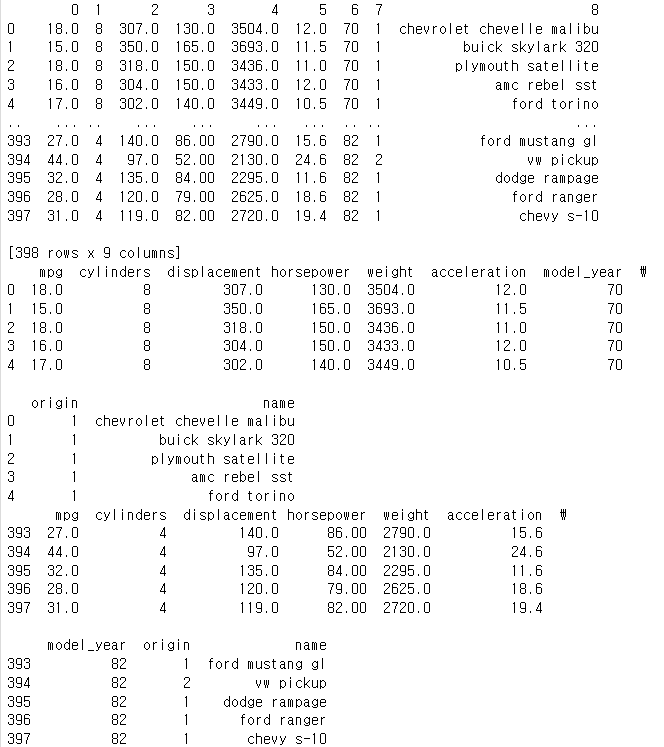

### **데이터프레임의 구조 살펴보기** 

- 데이터세트 auto_mpg.csv 사용

- mpg(연비), cylinders(실린더 수), displacement(배기량), horsepower(마력출력량), weight(차중)

- accleration(가속능력), model_year(출시년도), origin(제조국), model_name(모델명) 순

  

### **데이터 프레임의 내용 확인**

- Dataframe객체.head(숫자 또는 공란):공란-디폴트 최상단 5개 행
- Dataframe객체.tail(숫자 또는 공란):공란-디폴트 최하단 5개 행
- Dataframe객체.shape: 데이터프레임 모양과 크기 확인 (행과 열의 개수를 튜플로 반환)
- Dataframe객체.info(): 데이터프레임의 정보 summary
  - Pandas dataframe 자료형(dtypes); dtypes 각 열에 대한 자료형 확인
  - int(정수), float(실수), object(문자열), datetime, timedelta (시간 데이터)
- Dataframe객체.describe(): 데이터프레임의 기술통계량 요약 정보
  - 모든 열의 평균 값: DataFrame 객체.mean()
  - 특정 열의 평균 값: DataFrame 객체['열 이름"].mean()
  - Median (중앙값): 산술데이터를 갖는 모든 열의 중앙 값을 계산하여 시리즈로 반환 (median.())
  - 최대값 max(), 최솟값 min()
  - 표준편차 std(), 분산 var()
  - nunique(): 해당 열 데이터의 분별 가능한 값의 수(중복제외된 데이터 값)
  - corr() 함수 사용하여 모든 열에 대해 2개씩 짝을 지어 상관 계수를 계산

```python
import pandas as pd

# read.csv() 함수로 파일 불러오기
# 열을 따로 지정해주지 않기 위해 header를 none으로 지정
df = pd.read_csv('./auto-mpg.csv', header = None)

print(df)

# 열 이름 지정
df.columns = ['mpg','cylinders','displacement','horsepower','weight',
              'acceleration','model_year','origin','name']
print(df.head())
print(df.tail())
print(df.info())
print(df.describe())

# print 없이 입력해도 값을 확인할 수 있다.
# 데이터 중간 더블유 글자는 데이터 넘어가서 표시되는 것
```




.png)

.png)

.png)


