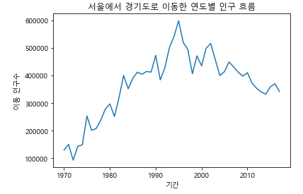

## 🛠 Pandas 라이브러리

1. Pandas 소개: 데이터 가공, 분석을 위한 파이썬 라이브러리

2. 내장 그래프 도구 다뤄보기

   - 데이터를 그래프로 표현하는 것은 매우 효과적인 정보 전달 방식

   - 시리즈 또는 데이터 프레임 객체에 plot() 함수를 적용하여 그래프를 생성

   - kind 옵션으로 그래프의 종류 선택 (예시)

     - line: 선 그래프

     - bar: 수직 막대 그래프

     - bath: 수평 막대 그래프

     - hist: 히스토그램

     - box : 박스 플롯

     - kde : 커널 밀도 그래프

     - area: 면적 그래프

     - pie : 파이 그래프

     - scatter: 산점도

     - hexbin : 고밀도 산점도

       

---

### 1. 선 그래프

데이터프레임 또는 시리즈 객체에 plot() 함수를 사용할 경우, 

다른 옵션을 추가하지 않으면 가장 기본적인 선 그래프로 그려짐

시계열 자료와 같이 연속형 데이터 자료를 시각화할 때 주로 사용


```python
# 남북한 발전량 합계 데이터를 추출: iloc
# 행 인덱스 변경 .index = [name]
# 열 이름(문자열 데이터)을 정수형으로 변경

import pandas as pd
df = pd.read_excel("./남북한발전전력량.xlsx")
df_ns = df.iloc[[0, 5], 2:]
df_ns.index = ['South', 'North']
df_ns.columns = df_ns.columns.map(int)

>>>
       1990  1991  1992  1993  1994  1995  1996  1997  1998  1999  ...  2007  \
South  1077  1186  1310  1444  1650  1847  2055  2244  2153  2393  ...  4031   
North   277   263   247   221   231   230   213   193   170   186  ...   236   

       2008  2009  2010  2011  2012  2013  2014  2015  2016  
South  4224  4336  4747  4969  5096  5171  5220  5281  5404  
North   255   235   237   211   215   221   216   190   239  

[2 rows x 27 columns]

# 시간의 흐름에 따른 연도별 발전량 추이를 보기 위해 연도 값을 x축에 표시
# 연도 값이 행 인덱스로 위치하도록 전치 transpose 진행

tdf_ns = df_ns.T
tdf_ns.plot()
```


### 2. 막대 그래프 & 히스토그램

- plot() 함수로 선 그래프가 아닌 다른 그래프를 그릴 때 kind 옵션으로 그래프 종류 지정

- `.plot(kind='bar')`: 막대 그래프

  

- `.plot(kind='hist')`: 1개 변수의 데이터 값 빈도수를 나타내는 히스토그램

  

  

### 3. 박스 플롯

- 특정 변수의 데이터 분포와 분산 정보를 나타냄
- 1개 이상의 열을 선택해서 만들 수 있음
- `.plot(kind = 'box')`
- 맨 위에 원은 수치에서 벗어난 수 표현
- 박스 최상단은 max값, 최하단 라인은 min값
- 박스 윗 라인 3분위 수 75%, 중간 라인 2분위 수 50%, 박스 끝 라인 1분위 수 25%
- cylinders 박스플롯 해석
  - 최댓값 = 3분위 수
  - 최솟값 = 1분위 수


___

### 

## 📊 Matplotlib

- 시각화 도구를 사용하여 다양한 종류의 데이터 분석 결과를 시각화 할 수 있음

- 판다스는 데이터 시각화를 지원하는 내장 기능이 존재하지만 풍부하지 않아서
  다른 시각화 도구와 함께 사용 권장

- 수많은 그래프에 관한 다양한 포맷과 기능을 지원

- 그래프 요소를 세세하게 꾸미기 가능

  

- 차트 제목, 축 이름 추가

  - 그래프에 차트 제목 추가 시 title() 함수 사용

  - x 축 이름은 xlabel() 함수 사용

  - y 축 이름은 ylabel() 함수 사용

    

- **"시도별 전출입 인구수"**자료로 간단한 그래프 실습

  - 데이터 전처리: Dataframe 확인 후 결측치 처리하여 분석 가능한 형태로 변환하는 과정
  - 사용 자료의 경우, 전출지별 누락 데이터, 결측치 (NaN) 다수 존재하여 변환
  - excel 파일에서 병합된 셀을 데이터프레임으로 변환할 때 적절한 값을 찾지 못해 발생
    - method = `ffill` 옵션을 사용하여 결측치가 있는 행의 바로 앞으로 위치한 데이터 값으로 채우기
    - 예시: '전국'으로 3행부터 18행까지 채우기

  

  - 추출하려는 자료: <u>서울-> 다른 지역 이동 데이터</u>

  1. method = ffill (상위 행 데이터를 아래 셀에 값 복사)
  2. 서울에서 다른 지역으로 이동한 데이터만 추출(a열은 서울, b열은 서울 x)
  3. 전출지별 열 제거
  4. 전입지별 -> 전입지로 변경
  5. 전입지를 행 인덱스로 지정

  

```python
import pandas as pd

# 데이터 시각화에 사용할 matplotlib.pyplot모듈을 import
import matplotlib.pyplot as plt

# matplotlib 한글 폰트 오류문제 해결
# fontmanger는 경로와 이름을 가지고 폰트를 지정
# rc는 폰트를 적용하는 역할

from matplotlib import font_manager, rc
font_path = "./malgun.ttf"
font_name = font_manager.FontProperties(fname=font_path).get_name()
rc('font', family = font_name)

# Excel 데이터를 데이터프레임으로 변환
df = pd.read_excel("./시도별 전출입 인구수.xlsx", header = 0)

# 결측치: 맨 위 데이터로 복사하여 채우기
df = df.fillna(method = 'ffill')

# 서울에서 다른 지역으로 이동한 데이터만 추출
mask = (df['전출지별'] == '서울특별시') & (df['전입지별'] != '서울특별시')

# 데이터 추출 시 조건을 추가하여 데이터프레임 새로 지정
df_seoul = df[mask]
df_seoul = df_seoul.drop(['전출지별'], axis=1)
df_seoul.rename({'전입지별':'전입지'}, axis=1, inplace=True)
df_seoul.set_index('전입지', inplace=True)

# 서울에서 경기로도 이동한 인구 자료만 추출
dt_g = df_seoul.loc['경기도']
dt_g.head()
dt_g.plot()
# plt.plot(dt_g.index, dt_g.values) 도 동일한 결과로 나옴

# 차트 제목 추가
plt.title('서울에서 경기도로 이동한 연도별 인구 흐름')

# 축 이름 추가
plt.xlabel('기간')
plt.ylabel('이동 인구수')

# 그래프 보기
plt.show()

# 경상남도부터 이하 행에 있는 지방까지 모두 추출하여 그래프 그리기
dt_group = df_seoul.loc['경상남도':].T
dt_group.plot()
```




### 1. Matplotlib 한글 폰트 문제 해결

- Matplotlib은 한글 폰트 지원 x
- 파이썬 프로그램 앞부분에 한글 폰트를 지정하는 코드 추가
- 위에 코드 참고 :)

```
from matplotlib import font_manager, rc font_path = "./malgun.ttf" font_name = fontmanger.FontProperties(fname=font_path).get_name() rc('font', family = font_name)
```

- 그래프 꾸미기 : x축 눈금이 겹쳐보이는 경우
  - 눈금 라벨이 들어갈 여유공간이 없어서 발생하는 문제
- 해결방법 2가지

1. 공간을 만들기 위해 figure()함수를 사용하여 그림틀의 가로 사이즈를 조절
2. xticks() 함수를 사용하여 x축 눈금라벨을 반시계 방향으로 90도 회전

- 그래프 그릴 때 유의사항
  - plt 함수 plot내 method끼리는 순서 상관없음
  - 하지만 xticks, figure, plot와 같이 다른 함수끼리는 코드 순서에 영향을 미침
  - 일반적으로 그래프 요소 별 작성 순서를 생각해보면 됨 (사이즈 -> 축 요소 -> 데이터 표시)


### 2. Matplotlib 스타일 서식 지정

- 색, 스타일 등 디자인적 요소를 사전에 지정된 스타일로 빠르게 변경 가능

  - 스타일 서식 지정: Matplotlib 실행 환경 자체를 변경하는 것
  - 변경하면 이후 코드 실행 할 때에도 계속 적용되는 점 유의
  - 스타일 서식 종류 
  - default, bmh, classic, dark_background, fast, grayscale, seaborn 등등
  - `matplotlib.style.use(style)`

  ```python
  # 스타일 서식 종류 확인하기
  print(plt.style.available)
  
  >>>
  ['Solarize_Light2', '_classic_test_patch', 'bmh', 'classic', 'dark_background', 'fast', 'fivethirtyeight', 'ggplot', 'grayscale', 'seaborn', 'seaborn-bright', 'seaborn-colorblind', 'seaborn-dark', 'seaborn-dark-palette', 'seaborn-darkgrid', 'seaborn-deep', 'seaborn-muted', 'seaborn-notebook', 'seaborn-paper', 'seaborn-pastel', 'seaborn-poster', 'seaborn-talk', 'seaborn-ticks', 'seaborn-white', 'seaborn-whitegrid', 'tableau-colorblind10']
  ```

  


