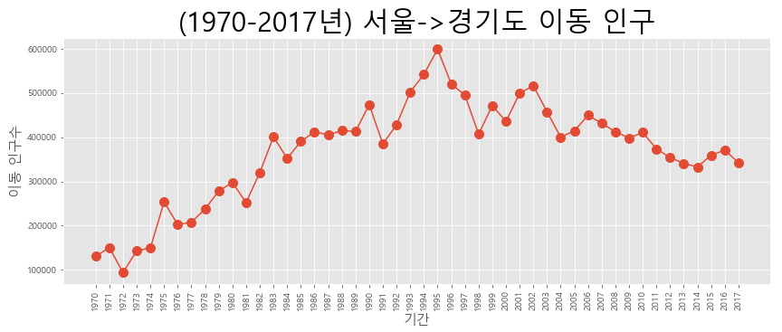
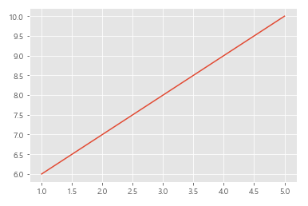
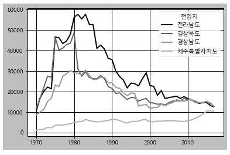
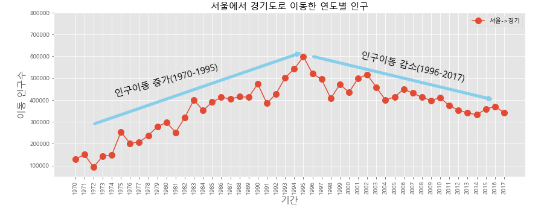

## Matplotlib_데이터 시각화 실습

- ''인구 이동 데이터''를 활용하여 서울에서 다른 시도로 이동한 트렌드 분석
- 'ggplot'을 비롯한 다른 스타일의 그래프 디자인 활용

### 1. 꺽은선 그래프 ('(1970-2017년) 서울->경기도 이동 인구')

```python
import pandas as pd

# 데이터 시각화에 사용할 matplotlib.pyplot모듈을 import
import matplotlib.pyplot as plt

# matplotlib 한글 폰트 오류문제 해결
# fontmanger는 경로와 이름을 가지고 폰트를 지정
# rc는 폰트를 적용하는 역할

from matplotlib import font_manager, rc
font_path = "./malgun.ttf"
font_name = font_manager.FontProperties(fname=font_path).get_name()
rc('font', family = font_name)

# Excel 데이터를 데이터프레임으로 변환
df = pd.read_excel("./시도별 전출입 인구수.xlsx", header = 0)

# 결측치: 맨 위 데이터로 복사하여 채우기
df = df.fillna(method = 'ffill')

# 서울에서 다른 지역으로 이동한 데이터만 추출
mask = (df['전출지별'] == '서울특별시') & (df['전입지별'] != '서울특별시')

# 데이터 추출 시 특정 조건을 추가하여 데이터프레임 새로 지정
df_seoul = df[mask]
df_seoul = df_seoul.drop(['전출지별'], axis=1)
df_seoul.rename({'전입지별':'전입지'}, axis=1, inplace=True)
df_seoul.set_index('전입지', inplace=True)

dt_g = df_seoul.loc['경기도']

# 스타일 서식 지정
plt.style.use('ggplot')

# 그림 사이즈를 지정 (가로 14인치, 세로 5인치)
plt.figure(figsize = (14, 5))

# x축 눈금 라벨 회전
# plt.xticks(rotation = 90)
plt.xticks(rotation = 'vertical')

# dt_g.plot(); x, y축 데이터를 함수에 직접 입력
plt.plot(dt_g.index, dt_g.values, marker= "o", markersize=10) # 마커표시 추가

# 차트 제목 추가
plt.title('(1970-2017년) 서울->경기도 이동 인구', size = 30)

# 축 이름 추가
plt.xlabel('기간', size = 15)
plt.ylabel('이동 인구수', size = 15)

# 그래프 보기
plt.show()

# ggplot 서식 이어지는 지 확인_선 그래프

x = [1, 2, 3, 4, 5]
y = [6, 7, 8, 9 , 10]
plt.plot(x, y)

```



- **다른 그래프 스타일 사용 & 서울-> 타 시도 이동 그래프**

```python
import pandas as pd
import matplotlib.pyplot as plt
from matplotlib import font_manager, rc
font_path = "./malgun.ttf"
font_name = font_manager.FontProperties(fname=font_path).get_name()
rc('font', family = font_name)

df = pd.read_excel("./시도별 전출입 인구수.xlsx", header = 0)
df = df.fillna(method = 'ffill')
mask = (df['전출지별'] == '서울특별시') & (df['전입지별'] != '서울특별시')

# 데이터 추출 시 조건을 추가하여 데이터프레임 새로 지정
df_seoul = df[mask]
df_seoul = df_seoul.drop(['전출지별'], axis=1)
df_seoul.rename({'전입지별':'전입지'}, axis=1, inplace=True)
df_seoul.set_index('전입지', inplace=True)

plt.figure(figsize = (20, 10))
plt.style.use('grayscale')
dt_group = df_seoul.loc['전라남도':].T
dt_group.plot()
```




### 2. 주석
- annotate() 함수를 사용, 위치 좌표(x, y)
 - x값: 인덱스 번호를 사용, ''(따옴표)로 묶어서 인덱스 네임으로도 지정 가능
 - y값: 인구 수 데이터를 갖고 사용
- 주석 내용(설명 텍스트)을 넣을 위치와 정렬방법 등을 전달
- arrowops 옵션을 활용한 화살표 등
 - 화살표 스타일도 지정 가능, 시작점과 끝점의 좌표를 입력
 - 예제에서는 주석을 넣을 여백 공간을 확보 ylim()함수를 사용하여 y축의 범위를 증가시킴
 - 증감 시점에 따른 설명 추가
- rotation 옵션 사용(양(+)의 회전 방향은 '반시계' 방향을 의미), 음수는 '시계방향' 회전을 의미

### 3. 범례
- `plt.legend(labels=['범례 텍스트'], loc='위치코드', fontsize=숫자)`
- location 코드
 - best: (디폴트 값) 그래프와 겹치지 않는 위치
 - center left/right: 중간 왼쪽/오른쪽
 - upper left/right/center: 상단 왼쪽/오른쪽/가운데
 - lower left/right/center: 하단 왼쪽/오른쪽/가운데

- 예제: 위 연간 서울-> 경기도 이동 인구 그래프 코드에 '주석', '범례' 추가

```python
# 범례 추가
# location 범례 위치, 우측 상단이 best
plt.legend(labels=['서울->경기'], loc='best', fontsize = 10)

# y축 이름 추가
plt.ylim(50000, 800000)

# 주석표시 - 화살표
# annotate(인덱스, 데이터)
plt.annotate('',
            xy=(25, 620000),    # 화살표의 머리 부분(끝점)
            xytext=(2, 290000), # 화살표의 꼬리 부분(시작점)
            xycoords='data',    # 좌표체계
            arrowprops=dict(arrowstyle='->', color='skyblue', lw=5) # 화살표 서식(스타일, 컬러, 굵기)
            )  
plt.annotate('',
            xy=(46, 400000),        # 화살표의 머리 부분(끝점)
            xytext=('1996', 600000),# 화살표의 꼬리 부분(시작점)
            xycoords='data',        # 좌표체계
            arrowprops=dict(arrowstyle='->', color='skyblue', lw=5) # 화살표 서식(스타일, 컬러, 굵기)
            )
# 주석표시_텍스트
plt.annotate('인구이동 증가(1970-1995)', # 텍스트 입력
            xy=(10, 490000),             # 텍스트 위치 기준점(중간)
            rotation=15,                 # 텍스트 회전 각도
            va='center',                 # 텍스트 상하 정렬('center','top','bottom')   
            ha='center',                 # 텍스트 좌우 정렬('center','left','right')   
            fontsize=15                  # 텍스트 사이즈 
            )

plt.annotate('인구이동 감소(1996-2017)', # 텍스트 입력
            xy=(37, 550000),             # 텍스트 위치 기준점(중간)
            rotation= -13,               # 텍스트 회전 각도
            va='center',                 # 텍스트 상하 정렬('center','top','bottom')   
            ha='center',                 # 텍스트 좌우 정렬('center','left','right')   
            fontsize=15                  # 텍스트 사이즈 
            ) 
```


