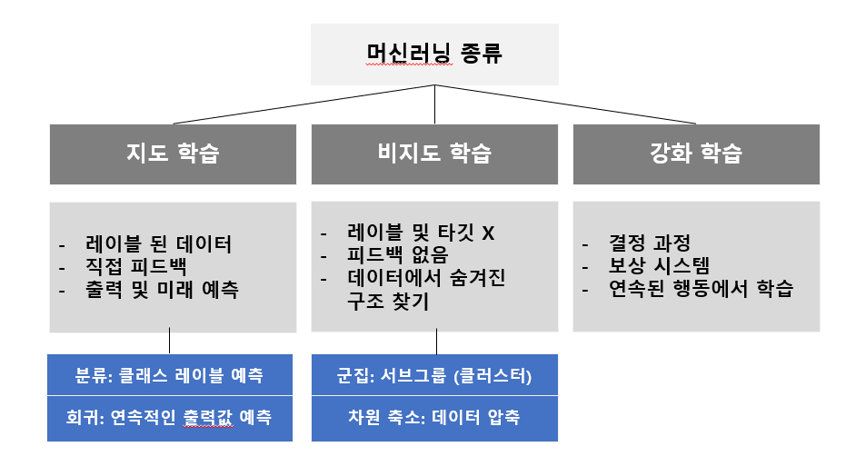

### 🔍 머신러닝의 개념

- 출현: 20세기 후반 데이터에서 지식을 추출하여 예측하는 자기학습(self-learning) 알고리즘과 관련된 인공지능 (Artificial Intelligence, AI) 분야의 하위 분야

- 컴퓨터 시스템에 명시적으로 프로그래밍 하지 않더라도 데이터를 스스로 학습하여 문제를 해결할 수 있게 하는 기술
- 사람이 인지하기 어려운 복잡한 규칙과 패턴을 파악하여 의미있는 결과를 얻을 수 있음
- 데이터에서 효율적으로 지식을 추출하여 예측 모델과 데이터 기반의 의사결정 성능을 점진적으로 향상시킬 수 있음

### 👀 머신러닝 방법론의 분류

1. <u>지도학습(Supervised Learning)</u>: 분류(classification) vs. 회귀(regression)

- label이 있는 상태에서 학습
- 범주형 (분류), 연속형 (회귀)
- 분류) 알고리즘 : KNN, Logistics regression, Softmax Regression
- 회귀) 알고리즘 : 딥러닝, NN, Random Forest, Decision Tree, Linear Regression

2. <u>비지도학습(Unsupervised Learning)</u>: 라벨이 없는 훈련용 데이터에서 x값 패턴 추출

- 자율 학습, 군집화(clustering), 차원축소(dimension reduction), 추천시스템(recommendation)
- **k-means clustering**: 특성 변수끼리 얼마나 유사하고 다른지 측정 → 레이블화
- **차원축소(dimension reduction)**: 1개의 관측샘플에 많은 측정지표가 있는 경우 알고리즘 계산
  - 성능을 높이고 저장공간 관리를 위해 진행
  - 특성변수만 모아서 변수의 수를 줄임(PCA)
  - 잡음(노이즈) 데이터를 제거하기 위해 특성 전처리 단계에서 종종 적용
  - 데이터 시각화에 유용
- **추천 시스템**: 커머스, 웹에서 흔하게 사용됨 ✨

3. <u>강화학습(Reinforcement Learning)</u>

- 행동하는 주체(agent)가 있고 행동을 했을 때의 상태와 보상을 바꿔주는 환경으로 구성됨
- 주체가 매번 어떠한 행동을 하면 환경에 의해 상태와 보상이 바뀌면서 주체는 보상이 가장 커지는 방향으로 계속 학습함.

___

### 머신러닝 모델의 검증 및 평가

- 새로운 데이터 왔을때 되려 예측력이 떨어지는 경우 (과적합)
- 과적합을 잘 이해하고 컨트롤하는 것이 성공여부 결정

**(지도학습) 모델 기반 알고리즘의 일반적인 분석 절차**

1. 주어진 데이터 전처리 탐색
2. 적절한 모델을 선택
3. 주어진 데이터로 모델을 훈련시킴
4. 훈련된 모델을 적용하여 새로운 데이터에 대한 예측을 수행

#### 과대적합(overfitting)의 문제 (예측하는 데이터와 실제 데이터 간 오차 발생)

- 주어진 자료는 거의 완벽한 예측이 가능하지만 미래의 새로운 자료에 대한 예측력이 떨어지는 문제

​- 복잡한 알고리즘을 사용하여 데이터를 훈련하는 경우 과대적합의 문제를 항상 염두해야 함.

- 모델 최적화를 위해 `훈련 데이터` 중 일부 떼어 놓고 사용하기도 함

- 모형을 단순화하다가 발생하는 오류가 과소적합(underfitting), 둘 사이의 밸런스가 중요

- 일반화 오차: 편향의 제곱 + 분산

- [**편향-분산 트레이드 오프(Bias-Variance Trade off)**](https://ko.wikipedia.org/wiki/%ED%8E%B8%ED%96%A5-%EB%B6%84%EC%82%B0_%ED%8A%B8%EB%A0%88%EC%9D%B4%EB%93%9C%EC%98%A4%ED%94%84)

  - 모델의 복잡도에 따라 훈련 데이터와 평가 데이터의 예측 오차는 편향-분산 trade off 관계를 갖으므로

    너무 낮지도 높지도 않은 복잡도와 예측 오차를 가져야 함

    > **편향이 높아질 수록 복잡도는 낮아지기에 분산이 낮아짐**
    >
    > **편향이 낮아질 수록 복잡도는 높아지며, 분산이 높아짐**

  - **과대적합을 막기 위한 방법**

    - 훈련 데이터를 많이 확보
    - 모델의 복잡도를 낮춤 (모델 튜닝)
      : 특정 변수의 수를 줄이거나 차원 축소
      or 파라미터에 규제 (regularization) 적용

#### 모델 검증 및 평가를 위한 데이터의 구분

- **Hold-out 방식**

1. 훈련데이터(training data): 모델의 학습을 위해 사용되는 자료 (ex. 80%)
2. 평가데이터(test data): 훈련 및 검증자료로 적합된 최종 모형이 미래에 주어질 새로운 자료에 대해 얼마나 좋은 성과를 갖는지 평가하는데 사용되는 자료
  - 일반적으로 성능: 평가데이터 정확도 < 훈련 데이터)
  - 모델 튜닝을 위해 훈련데이터에서 validation 데이터로 조금 할당함 (ex. 20%)
    → 훈련에 필요한 하이퍼파라미터를 조정하거나 변수 선택 등에 이용

- **K-fold CV** (교차검증 방식, Cross-validation) : 보통 5 or 10 fold

: 훈련하는 데 데이터가 많아서 시간이 오래 걸리지만, 학습 데이터를 다 사용할 수 있음.

    1. 자료를 균등하게 k개 그룹으로 분할
    2. 각 j에 대하여 j번째 그룹을 제외한 나머지 k-1개 그룹의 자료를 이용하여 모델을 적합
    3. j번째 그룹의 자료에 적합된 모델을 적용한 뒤 예측 오차를 구함
    4. j = 1, ... , k에 대하여 위 과정 반복하고 k개의 예측 오차의 평균을 구함
    5. 예측오차의 평균 값을 기준으로 모델의 검증 또는 평가를 수행