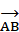
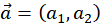
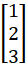
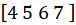
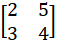
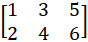

## 딥러닝 기초_신경망 이해를 위한 기초수학

### 선형(Iinear)대수학(Algebra)

- 개념: 벡터 공간, 벡터, **선형** 변환, 행렬, 연립 **선형** 방정식 등을 연구하는 **대수학** 의 한 분야
- 키워드: 연립선형방정식의 해, 벡터공간, 차원

### 선형과 선형 방정식

- 최고차항의 차수가 1인 방정식(=일차방정식)

### 기본 개념

- 스칼라(scalar): 길이, 넓이, 질량, 온도 등 크키만 갖는 수

- 벡터(vector): ‘배달하다, 운반하다’ 라틴어에서 유래, **‘크기와 방향’** 정보를 나타내는 것

  - 화살표로 표기

  - 유향선분(directed segment): 방향을 갖는 A, B 

    

    

  - 벡터의 성분표기: 시작점을 원점으로 했을 때 종점의 좌표 표기 (a1, a2), (x, y) 등

  

  

  - 열 벡터, 행 벡터 예시

  

  

  

- 행렬(matrix): 사각형으로 된 수의 배열, 1개 이상의 벡터 모임

  - m개의 행과 n개의 열로 구성 (`mxn 행렬`)

2 X 2 행렬

2 X 3 행렬

- 텐서(tensor): [선형 관계](https://ko.wikipedia.org/wiki/선형_변환)를 나타내는 [다중선형대수학](https://ko.wikipedia.org/wiki/다중선형대수학)의 대상