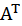
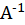

### 행렬 복습

1. 연산

- 같은 형태(shape) 일때 덧셈, 뺄셈 가능
- 행렬 곱셈: 곱하는 행렬 AB의 (A의 열)과 (B의 행)이 같은 형태여야 함 또는 벡터의 점곱처럼 계산가능

2. 전치행렬 : 행과 열의 원소의 위치를 주대각선을 축으로 하여 교환한 행렬 ()

3. 역행렬: ***AB=I=BA***일 때, B는 A의 역행렬()

4. 단위행렬: 주 대각선의 원소가 모두 1,  나머지 원소는 모두 0인 정사각행렬

   

```python
import numpy as np

A = np.array([[1, 2], [3, 4]])
B = np.array([[5, 6], [7, 8]])

A+B
>>> 
# array([[ 6,  8],
#       [10, 12]])

B-A
>>>
# array([[4, 4],
#       [4, 4]])

B = np.array([[1, 2], [3, 4], [5, 6]])
print(B)
>>>
#[[1 2]
# [3 4]
# [5 6]]

np.ndim(B)# 2차원 배열
B.shape # (3,2)

# 행렬의 곱 ((2X3)X(3X2)=(2X2))

A = np.array([[1, 2, 3], [3, 4, 5]])
B = np.array([[5, 6], [7, 8], [9, 10]])

np.dot(A, B)
>>>
# array([[ 46,  52],
#       [ 88, 100]])

# 행렬의 곱 ((2X3)X(3X1)=(2X1))

A = np.array([[1, 2, 3], [4, 5, 6]])
B = np.array([7, 8, 9])

C = np.dot(A, B)
print(C)
C.shape

>>>
# [ 50 122]
# (2,)

# 전치행렬
A = np.array([[1, 2, 3], [4, 5, 6]])
B = np.array([[5, 6], [7, 8], [9, 10]])

C = A.transpose()
C
>>>
# array([[1, 4],
#       [2, 5],
#       [3, 6]])

```