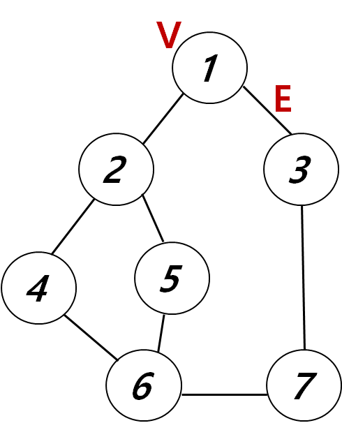

### 📑 알고리즘 특강 (Day3) 노트


#### 1. 파이썬 문법 복습

- **2차원 리스트** **& 이중 for 문**

  - `M X N` 행렬 matrix가 주어졌을 때, 아래와 같은 방법으로 구성 요소 탐색 가능

    - 행 기준 순회
    - 열 기준 순회
    - 지그재그 순회

    - 전치 (Transpose) : 이전 선형대수학 노트에 적은 것과 같이 주대각선을 기준으로 대응되는 위치에 있는 원소를 뒤집는 것

      → 기술적인 부분을 보기에 앞서 구조 측면에서 생각해보면, (0, 0), (1, 1), (2, 2)와 같이 대각선 좌표의 요소는 움직이지 않아도 되어 if문으로

      양쪽 1군데만 지정하여 변경하면 됨.

      

  - `**이중 for 문 동작 순서**` 잘 파악하기: 
    - 첫번째 for 문 1번째 원소 -> 두번째 for문 반복 (+ if문으로 조건 필터링 실행됨)
    - 위 내용 다 실행 시 첫번째 for문으로 돌아와서 2번째 원소인 상태에서 다시 두번째 for문 반복

  

  - **리스트 컴프리헨션**: 기존 리스트와 for문을 1줄에 사용하여 간결하게 작성하는 방법

    - 일반적으로 사용되는  기존 for 문 리스트 코딩법 보다 실행 시간이 30% 단축됨 → 효율적인 연산 가능 (Numpy 보다는 느리지만)

    - 자주 사용하는 코딩법으로 꼭 익히기!

      

  ```python
  matrix = [[1, 8, 4],
            [7, 3, 9],
            [5, 2, 6]]
  
  # 행 기준 순회
  for r in range(3):
      for c in range(3):
          print(matrix[r][c], end= " ")
  
  >>> 1 8 4 7 3 9 5 2 6
  
  # 흔적을 리스트화 할 경우
  
  trails = []  # 순회 궤적 담아줄 리스트
  
  for r in range(3):
      if r % 2 == 0:
          for c in range(3):
              trails.append(matrix[r][c])
      elif r % 2 == 1:
          for c in range(2, -1, -1):
              trails.append(matrix[r][c])
  
  print(trails) # [1, 8, 4, 9, 3, 7, 5, 2, 6]
  
          
  # 열 기준 순회
  for r in range(3):
      for c in range(3):
          print(matrix[c][r], end= " ") # 이 부분이 바뀜
  
  >>> 1 7 5 8 3 2 4 9 6   
          
  
  # 변수 재 지정
  a = 3
  b = 4
  a, b = b, a
  
      
  # 전치
  matrix2 = [[1, 8, 4],
             [5, 3, 9],
             [7, 2, 6]]
  
  for r in range(3):
      for c in range(3):
          if r < c:
              matrix2[r][c], matrix2[c][r] = matrix2[c][r], matrix2[r][c]
  
  for _ in range(3):
      print(matrix2[_])
      
  >>> [1, 5, 7]
  >>> [8, 3, 2]
  >>> [4, 9, 6]
  
  
  # 인접행렬 만드는 주요 리스트 컴프리헨션
  [[0]*3 for _ in range(3)]
  
  >>> 
  [[0, 0, 0],
   [0, 0, 0],
   [0, 0, 0]]
  
  ```

  

- **✨ zip 함수의 다양한 용법**
  - 기본: 같은 위치에 있는 원소를 묶어주는 함수, 같은 위치에 있지 않으면 해당 되는 것만 진행, `튜플`로 반환
  - 행렬 언패킹하면 가장 큰 대괄호를 없앰, 튜플이라 가공이 불편할것 같으면 열로 순회해서 리스트만 남기면 됨


```python
# zip 기능 확인 및 리스트화

a = [1, 2, 3]
b = [4, 5, 6]
print(list(zip(a, b)))
>>> [(1, 4), (2, 5), (3, 6)]

# zip 하는 자료의 길이가 다를 경우

c = [1, 2, 3, 4, 5]
d = [3, 4, 5]
print(list(zip(c, d)))
>>> [(1, 3), (2, 4), (3, 5)]

# 2개 이상의 자료형도 가능하며, str, tuple도 가능

e = [1, 2, 3, 4, 5]
f = [3, 4, 5, 'hi']
g = [(1, 2), 'go', 6, 5, 'world']
print(list(zip(e, f, g)))
>>> [(1, 3, (1, 2)), (2, 4, 'go'), (3, 5, 6), (4, 'hi', 5)]

# Unpacking 기능 활용 시

matrix = [[1, 8, 4],
          [5, 3, 9],
          [7, 2, 6]]
t = list(zip(*matrix)) # 행렬 언패킹하면 가장 큰 대괄호를 없앰
print(t)
>>> [(1, 5, 7), (8, 3, 2), (4, 9, 6)]

```


#### 2. 알고리즘 개념

-  리스트(List)를 통해 사용 가능합니다.
- append와 pop 메서드를 이용하여 스택에 데이터를 삽입, 추출 할 수 있습니다. (que의 경우 pop(0))


##### (1) Stack : 가장 마지막에 들어온 데이터가 가장 먼저 나가는 LIFO(Last-in First-out, 후입선출) 방식

- **가장 먼저 들어온 자료를 먼저 빼지 않으려고 함 (리스트를 모양을 세로로 뒤집는 다고 생각했을 때 바닥 부분)**

- 접시를 쌓고 빼듯이, 데이터를 한쪽에서만 넣고 빼는 자료구조

- 실생활 예: 브라우저의 뒤로 가기, 인터넷 방문기록, 검색어 기록, 함수 호출 순서

  

[10773번: 제로](https://www.acmicpc.net/problem/10773)

```python
stack = []

for i in range(int(input())):
    num = int(input())
    if num == 0:
        stack.pop()
    else:
        stack.append(num)

print(sum(stack))
```


##### (2) Que: 가장 먼저 들어온 데이터가 가장 먼저 나가는 FIFO(First-in First-out, 선입선출) 방식

- **가장 늦게 들어온 자료를 먼저 빼지 않으려고 함**
- 음식점의 대기 줄, 한 차선의 자동차들 등등 실생활에서 볼 수 있는 예시가 많습니다. (선착순 진행, 유통기한 짧은 재고 처리)


[2161번: 카드1](https://www.acmicpc.net/problem/2161)

```python
n = int(input())
queue = list(range(1, n+1))

while len(queue) > 1:
    print(queue.pop(0), end=" ")
    queue.append(queue.pop(0))
    
print(queue[0])
```





| 노드(7) | 간선(8) |
| ------- | ------- |
| 1       | 2       |
| 1       | 3       |
| 2       | 4       |
| 2       | 5       |
| 4       | 6       |
| 5       | 6       |
| 6       | 7       |


##### (3) DFS (Depth First Search) : 한붓그리기, 깊이 우선 탐색

- Vertax: 노드

- Edge: 간선 (노드를 이은 선)

- Stack 사용

- V, E의 숫자가 input 될 때 V 행을 기준으로 인접행렬 만들기

  

```python
a = [[0]*3 for _ in range(3)] # 3 X 3 행렬 만들 때
# print(a)

# 다른 a = [[0]*3]*3으로 절대하지 말것! 저장 위치가 같아져서 데이터 변경 시 같이 바뀜

V, E = map(int, input().split()) # V, E 포도알 갯수, 선 갯수
adj_mat = [[0]*(V+1) for _ in range(V+1)] # 0으로 채워진 8 X 8 틀 만들기! 

for i in range(E):
    start, end = map(int, input().split()) # 만약 1, 2를 인풋 받으면
    adj_mat[start][end] = 1 # 일단은 adj_mat[1][2] = 1
    adj_mat[end][start] = 1 # 무향 그래프이기 때문에 파트너도 넣어줌

for _ in range(V+1):
    print(adj_mat[_])

visited = [] # 방문했던 포도알을 기록
stack = [1]    # 1번에서 시작

while stack: # 스택이 빌 때까지 돌아랏!! 리스트가 비면 False로 봐서 끝남
    current = stack.pop()
    if current not in visited: # 그 점을 방문하지 않았으면 추가함
        visited.append(current)

    for destination in range(V+1):
        if adj_mat[current][destination] == 1 and destination not in visited: # 이어져 있고 +  방문하지 않았을 때
            stack.append(destination) # 종착지를 stack에 추가함

print(visited)
```


##### (4) BFS (Breadth First Search) : 넓이 탐색, 진앙지처럼 퍼져가면서 탐색

- 같은 길이, 간선을 지나는 노드 순서대로 출력

- queue 개념 사용

  

```python
V, E = map(int, input().split())

adj_arr = [[0]*(V+1) for _ in range(V+1)]

for i in range(E):
    start, end = map(int, input().split())
    adj_arr[start][end] = 1
    adj_arr[end][start] = 1

visited = []
Queue = [1] # DFS와 다른 점

while Queue:
    current = Queue.pop(0) # DFS와 다른 점
    if current not in visited:
        visited.append(current)

    for destination in range(V+1):
        if adj_arr[current][destination] and destination not in visited:
            Queue.append(destination) # DFS와 다른 점
            
print(visited)
```

