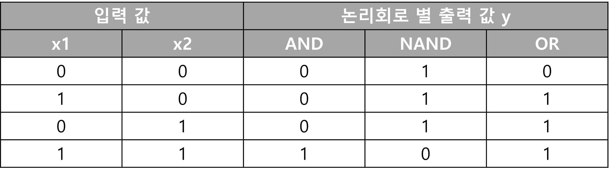
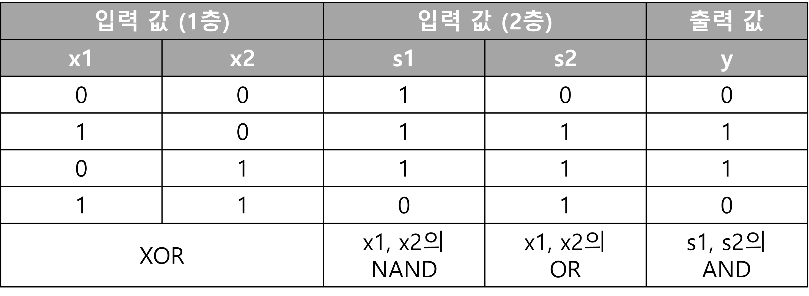

## Deep Learning 이론_기초


### 퍼셉트론(Perceptron)

- 신경망의 기초가 되는 알고리즘으로 신호를 입력하면 정해진 규칙에 따라 신호를 출력하는 것

- 신호가 있는 것을 1, 없으면 0

- '가중치'와 '편향'을 매개 변수로 설정한다.

  - 가중치 (Weight): 각 신호 x1, x2의 영향력을 제어
  - 편향 (Bias): 뉴런이 얼마나 쉽게 활성화 되느냐에 영향을 끼침

- `AND` `OR` 게이트 등의 논리 회로를 표현할 수 있다.

- XOR 게이트는 단층 퍼셉트론으로는 표현할 수 없다. (2층 퍼셉트론을 이용하면 표현 가능)

- **단층 퍼셉트론은 직선형 영역만 표현**할 수 있고, **다층 퍼셉트론은 비선형 영역도 표현**할 수 있다.

- 다층 퍼셉트론은 이론상 컴퓨터를 표현할 수 있다.

  

### 논리 회로

- AND: 모두 참일 때 참, 1개라도 거짓이면 거짓
- NAND: Not And라서 And를 거꾸로 뒤집은 것
- OR: 1개라도 참이면 참, 모두 거짓일때 거짓
- XOR: 배타적 논리합, 입력 값이 같으면 0, 다르면 1 (한 쪽이 1일때만 1을 출력)








```python
# And Gate 구현

def fun_and(x1, x2):
    
    w1, w2, threshold = 0.5, 0.5, 0.7
    flag = w1*x1+w2*x2
    
    if flag <= threshold :
        return 0
    elif flag > threshold:
        return 1

print(fun_and(0,0), fun_and(1,0), fun_and(0,1), fun_and(1,1))
>>> # 0001

# OR Gate 구현

def fun_or(x1, x2):
    
    w1, w2, threshold = 1.2, 1.5, 1
    flag = w1*x1+w2*x2
    
    if flag < threshold :
        return 0
    elif flag >= threshold:
        return 1

print(fun_or(0,0), fun_or(1,0), fun_or(0,1), fun_or(1,1))
>>> # 0111

# XOR Gate

def fun_xor(x1, x2):
    tmp = fun_or(fun_and(not x1, x2), fun_and(x1, not x2))
    return tmp

print(fun_xor(0,0), fun_xor(1,0), fun_xor(0,1), fun_xor(1,1))
>>> # 0110

```


### 활성화 함수 (Activation Function)

- 입력 신호의 총합을 출력 신호로 변환하는 함수
- 입력 신호의 총합이 활성화를 일으키는 지 정함
- 종류에 따라 학습결과가 달라지며, 어떤 활성화 함수가 최적인지는 실험을 통해 알수 있음
  - 종류: identity 함수 f(x) = x, 계단함수, 시그모이드 함수, TanH, Arc Tan, Softsign, ReLU(Rectified Linear Unit)