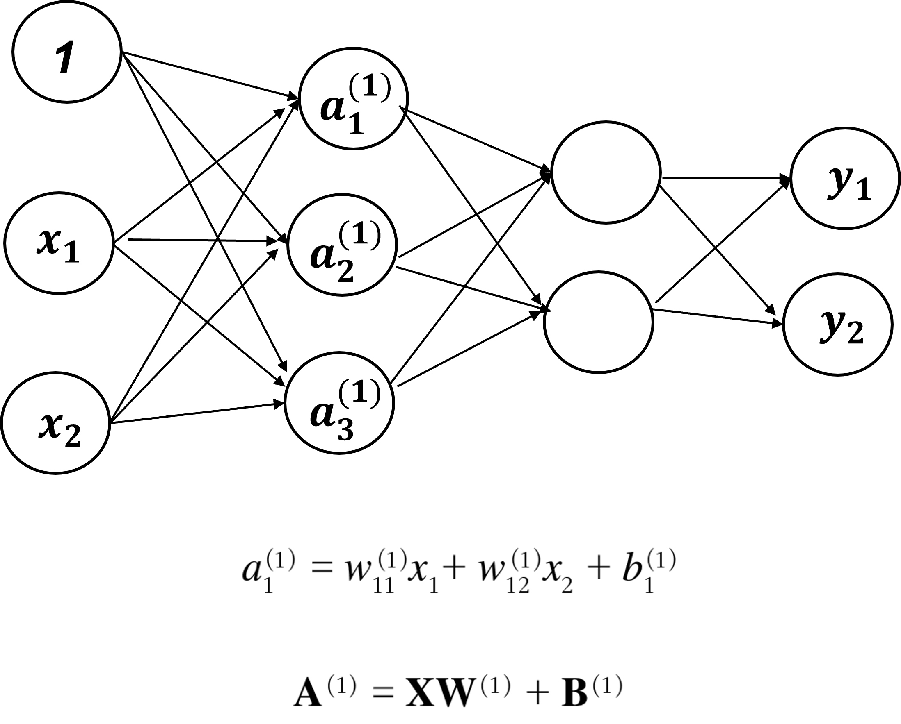

## Deep Learning 이론_기초

- 배경 지식

  - **기계학습의 구분**

    - 회귀: (연속데이터) 입력데이터에서 수치를 예측하는 문제 (예, 몸무계, 속력, 매출액)

    - 분류: (이산, 비연속 데이터) 어느 class에 속하느냐 (예, 사진 속 인물의 성별을 맞춰라)

      - 출력층의 뉴런의 수를 분류하려는 class (차원)와 같게 설정

        

  - **기계학습의 문제 풀이: 학습과 추론 2단계를 거침**

    1) 학습단계: 모델을 학습
    2) 추론: 학습한 모델로 미지의 데이터에서 추론(분류) 

    

### * 활성화 함수*

- 입력 신호의 총합을 출력 신호로 변환하는 함수

- 퍼셉트론에서 활성화 함수로 계단함수를 이용

- 계단함수 이외의 함수를 퍼셉트론에 사용 가능하며 풀고자하는 문제 상황에 맞게 사용

- **출력층에서 주로 사용하는 활성화 함수**

  - 회귀: 시그모이드 함수

  - 다중 클래스 분류: 소프트맥스 함수

    

### 1. 계단 함수 (Step function)

- 입력이 0을 넘기면 1을 출력
- 이외에는 0을 출력


```python
import numpy as np
import matplotlib.pylab as plt

def step_function(x):
    return np.array(x > 0, dtype = np.int)

x = np.arange(-5.0, 5.0, 0.1)
y = step_function(x)
plt.plot(x, y)
plt.ylim(-0.1, 1.1) # y축의 범위 지정
plt.show()
```


### 2 시그모이드 함수 (Sigmoid function)


- exp(-x)=e^(-x)
- e는 자연상수로 2.7182... 을 값을 갖는 실수
- 신경망에서는 활성화 함수로 시그모이드 함수를 이용하여 신호를 변환, 그 변환된 신호를 다음 뉴런에게 전달

```python
def sigmoid(x):
    return 1 / (1 + np.exp(-x))

x = np.array([-1.0, 1.0, 2.0])
sigmoid(x)

t = np.array([1.0, 2.0, 3.0])
# 1.0 + t 처럼 덧셈 연습 가능
# 1.0 / t 처럼 곱셈 연습 가능

```


#### *시그모이드 함수와 계단 함수 비교*

- 공통점

  - 입력이 중요하면 큰 값을 출력, 중요하지 않으면 작은 값을 출력

  - 아무리 입력이 작거나 커도 출력은 0~1 사이

  - 비선형 함수: 선형이 아닌 함수 (직선 1개로는 그릴 수 없음)

    

- 차이점

  - 매끄러움 정도의 차이
  - 계단함수는 0 또는 1 출력, 시그모이드 함수는 연속적인 실수 출력


### 3. ReLU 함수 (Rectified Linear Unit)

- 입력이 0을 넘으면 입력을 그대로 출력, 0 이하면 0을 출력

- 넘파이의 maximum 함수 사용해서 만들 수 있음

  


```python
def relu(x):
    return np.maximum(0, x)

x = np.arange(-6.0, 6.0, 0.1)
y = relu(x)
plt.plot(x, y)
plt.ylim(-1, 5)
plt.show()
```


### 4. 다층 퍼셉트론 알아보기

- 각 층의 신호 전달 구형 (by 행렬의 곱)
- 앞써 배운 가중치 w1, w2, 편향 b 로 `선형화 후 가중신호와 편향의 총합`을 활성화 함수 h(x) 에 넣어 3번 동일한 계산 반복 (아래 예시의 경우 1,2 층 활성화함수로 시그모이드, 마지막은 항등함수 사용)



```python
# 1층 신호값, 가중치, 변향
X = np.array([1.0, 0.5])
W1 = np.array([[0.1, 0.3, 0.5],[0.2, 0.4, 0.6]])
B1 = np.array([0.1, 0.2, 0.3])

X.shape
W1.shape
B1.shape

A1 = np.dot(X, W1) + B1
Z1 = sigmoid(A1)

# 2층
W2 = np.array([[0.1, 0.4], [0.2, 0.5],[0.3, 0.6]])
B2 = np.array([0.1, 0.2])

A2 = np.dot(Z1, W2) + B2
Z2 = sigmoid(A2)

# 입력값을 그대로 출력하는 항등함수
def identity_function(x):
    return x

# 3층
W3 = np.array([[0.1, 0.3],[0.2, 0.4]])
B3 = np.array([0.1, 0.2])

A3 = np.dot(Z2, W3) + B3
Y = A3

print(Y)
# [0.31682708 0.69627909]
```


- 3층 신경망 신호전달 코드 요약

  - 신호의 방향이 순 방향 (입력 → 출력): 순전파이라서 forward라는 함수 명 사용

  - 데이터 학습 초깃값을 아래와 같이 지정, 딥러닝 실전에서는 데이터셋에서 정규분포로 샘플링함

    

```python
def init_network():
    network = {}
    network['W1'] = np.array([[0.1,0.3,0.5],[0.2,0.4,0.6]])
    network['b1'] = np.array([0.1,0.2,0.3])
    network['W2'] = np.array([[0.1,0.4],[0.2,0.5],[0.3,0.6]])
    network['b2'] = np.array([0.1,0.2])
    network['W3'] = np.array([[0.1,0.3],[0.2,0.4]])
    network['b3'] = np.array([0.1,0.2])
    
    return network

def forward(network, x):
    W1, W2, W3 = network['W1'], network['W2'], network['W3']
    b1, b2, b3 = network['b1'], network['b2'], network['b3']
    
    a1 = np.dot(x, W1) + b1
    z1 = sigmoid(a1)
    a2 = np.dot(z1, W2) + b2
    z2 = sigmoid(a2)
    a3 = np.dot(z2, W3) + b3
    y = identity_function(a3)
    
    return y

network = init_network()
x = np.array([1.0, 0.5])
y = forward(network, x)
print(y)
# [0.31682708 0.69627909]
```


### 5. 소프트맥스 함수

- n : 출력층의 뉴런수
- y_k는 그중 k 번째 줄력을 뜻한다.
- 소프트맥스의 출력은 모든 입력 신호로부터 화살표를 받는다.
- 분모에서 보듯, 출력층의 각 뉴런이 모든 입력 신호에서 영향을 받기 때문이다.
- **특징**
  - 함수의 출력: 0~1 사이, 총합은 1 → 소프트맥스 함수의 출력 '확률'로 해석
  - 주의) 각 원소의 대소관계는 변하지 x (exp(x) 함수가 단조 증가 함수라서)


```python
a = np.array([0.3, 2.9, 4])

exp_a = np.exp(a) # 지수함수
sum_exp_a = np.sum(exp_a) # 지수함수의 합
y = exp_a/sum_exp_a

```


