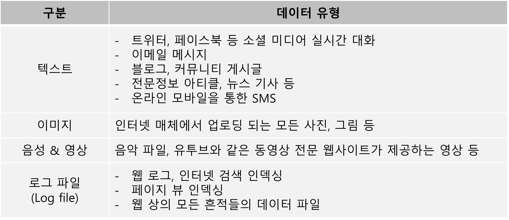

## 🔎 비정형 데이터 정의 및 특징

- **비정형 데이터**란?

  : 사전에 정의된 데이터 분석 모델을 가지고 있지 않으며, 데이터의 구조와 형태가 데이터 마다 다르고, 정형화 되지 않은 문서, 영상, 음성 등을 의미

  - 예시: 책, 저널, 문서, 메타 데이터, 건강 기록, 오디오, 비디오, 메시지, 이메일, 웹 페이지 등

  - 유형

    

- **반정형 데이터**: 불규칙 정도에 따라 비정형 데이터는 반정형 데이터 (Markup 언어, 이메일, EDI 등)으로 

  구분하며, 관계형 데이터 베이스나 다른 형태의 데이터 테이블로 조직된 데이터 모델의 정형적 구조를 

  따르지 않지만, 어의적 요소를 분리시키고, 데이터 내 레코드와 필드의 계층 구조가 있게 하는 

  Tag 나 다른 Marker를 포함하는 정형 데이터를 의미

- 비정형 데이터의 내용 파악과 비정형 데이터 속 패턴 발견을 위해 데이터 마이닝, 텍스트 분석, 

  비표준 텍스트 분석과 같은 다양한 기법을 사용

- 비정형 데이터 탐색 & 정련 과정을 통해 정형 데이터로 만든 후,

  **분류, 군집화, 회귀분석, 요약, 이상감지 분석** 등의 데이터 마이닝을 통해 정보 발굴