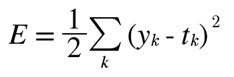

## 신경망 학습 (Neural Network)

- 신경망의 특징

  - 데이터를 보고 학습 => 가중치 매개변수의 값을 데이터를 보고 자동으로 결정

  - 학습: 훈련 데이터로부터 가중치 매개 변수의 최적값을 자동으로 획득하는 것

  - 기계 학습의 중심에 있는 `데이터` 를 이용하여 사람의 개입을 최소화하고, 수집한 데이터로부터 패턴을

    찾으려고 시도하는 방식

  - 주어진 데이터를 온전히 학습하고 주어진 데이터를 그대로 입력 데이터로 활용

    

- 일반적인 기계학습 과정

  - 훈련 데이터와 시험 데이터로 나눠 학습과 실험을 수행
    1. 훈련 데이터로 학습하며 최적의 매개 변수 찾기
    2. 시험 데이터로 훈련한 모델 평가
    3. 오버 피팅을 피해야 하며, 딥러닝의 경우 **손실함수 값을 최소화** 하여 오차를 줄이려 함

  - 학습 용어
    1. Epoch: 전체 데이터를 1바퀴 돌면서 학습하는 것 (2 epochs: 전체 샘플 2바퀴 돌며 학습)
    2. Step: Weight와 Bias를 1회 업그레이드하는 것 1 step = Iteration
    3. Batch: 1 Step에서 사용한 데이터 셋의 수 (Batch size)
    4. 참고) `one-hot encoding` 1개 원소만 1로 하고 그외는 0으로 나타내는 표기법
  - 데이터의 처리
    - 우리가 사용하는 데이터는 <u>벡터화</u>되어 병렬 처리 되며,
    - 전체 데이터를 사용하기에는 메모리 부족으로 **Batch size**를 지정 (랜덤 선정)하여 학습


### **손실함수 (Loss Function)**

- 일반적으로 오차제곱합(SSE)와 교차 엔트로피 오차(Cross Entropy Error, CEE) 사용

- **손실함수: 신경망 성능의 '나쁨'을 나타내는 지표로, 현재의 신경망이 훈련 데이터를 얼마나 잘 처리하지 '못'하느냐를 나타낸다.**

- 비용함수 (Cost Function) 이라고도 불린다.(손실에는 그만큼의 비용이 발생하기 때문)

 - 예를 들어 총 10개의 값으로 0~9중 어떤 값인지 나타내는 확률이 나열된 배열을 생각해보자.

   ```python
   y=[0.1, 0.05, 0.6, 0.0, 0.05, 0.1, 0.0, 0.1, 0.0, 0.0]
   t=[0,0,1,0,0,0,0,0,0,0]
   
   # y는 소프트 맥스 함수의 출력이다.
   # t는 원-핫 인코딩 방식을 이용한 표기법이다.
   ```

   

### 왜 손실 함수를 설정 하는가?

- 우리의 목적은 높은 "정확도"를 끌어내는 매개변수 값을 찾는 것이다.

- 정확도라는 실제적인 값이 있지만 이를 사용하지 않고 함수를 사용하는 이유는

  **미분을 통해 최적 값을 찾아낼수 있기 때문**

  - 신경망의 학습에서 최적의 매개변수(가중치와 편향)를 탐색할 때 손실 함수의 값을 가능한 작게 하는 매개변수 값을 찾는다.

  - 매개변수의 미분을 계산하고, 그 미분 값을 단서로 매개변수 값을 서서히 갱신하는 과정을 반복

  - 이때 매개변수의 미분(기울기)을 계산, 미분값을 단서로 매개변수의 값을 서서히 갱신하는 과정을 반복 

  - <u>신경망을 학습할 때 정확도를 지표로 삼아서는 안 된다. 정확도를 지표로 하면 매개변수의 미분이 대부분의 장소에서 0이 되기 때문이다.</u>

  - 매개변수를 약간만 조정해서는 정확도가 개선되지 않고 일정하게 유지. 개선되도 불연속적인 값으로 바뀜.

  - 손실함수를 지표로 삼으면 매개변수 값이 조금 변하면 그에 반응하여 연속적으로 변화.

    



1. **평균 제곱 오차(MSE)**
   - (오차제곱합(Sum of Squared for Error,  SSE)

> •yk는 신경망의 출력(신경망이 추정한 값)
>
> •tk는 정답 레이블
>
> •k는 데이터의 차원 수
>
> •2는 크게 의미 없는 숫자 같지만 추후 미분을 위해 존재


[코드로 알아보자!]

```python
import numpy as np
def mean_squared_error(y, t):
    return 0.5*np.sum((y-t)**2)
# for 문을 이용해서 구현해야 할것같지만 for 문을 사용할 필요가 없다. 배열의 장점

y=[0.1, 0.05, 0.6, 0.0, 0.05, 0.1, 0.0, 0.1, 0.0, 0.0]
t=[0,0,1,0,0,0,0,0,0,0]

mean_squared_error(np.array(y),np.array(t))
# 0.09750000000000003
```


2. **교차 엔트로피 오차(Cross Entropy Error, CEE)**

> - log는 밑이 e인 자연로그(ln)이다.
> - yk는 신경망 출력
> - tk는 정답 레이블 (정답에 해당하는 인덱스의 원소만 1이고 나머지는 0인 원-핫 인코딩 사용)
> - tk=1(즉, 정답)일때만 자연 로그를 계산하는 식이다.
> - 맨앞이 음수처리된 이유는 신경망의 출력값이 0~1 사이의 값이기때문에 양수로 만들어 주기 위해서 이다.
> - 예
>   - 정답 레이블 '2'
>   - 신경망 출력 '0.6'
>   - 교차엔트로피 오차는 −log0.6=0.51−log0.6=0.51
>   - 같은 조건에서 신경망 출력이 '0.1'이라면 −log0.1=2.30−log0.1=2.30이 된다.
>   - 신경망의 결과값이 정답에 가깝게 나타날경우 (1에 가까운 숫자) 오차 값이 줄어들고, 0에 가깝게 나타날수록 오차는 커진다.
>   - e = 10 을 의미한다.
>   - 1e-7 = 1/(10의 7제곱)
>   - delta를 더해준 이유는 np.log() 함수에 0을 입력하며 마이너스 무한대가 되기 때문에 더이상 계산을 진행할수 없다. 따라서 0이 되지 않기 위함


[코드로 알아보자!]

```python
import matplotlib.pyplot as plt
x=np.arange(0.01,3,0.005)
f=np.log(x)
plt.plot(x,f)
plt.show()

def cross_entropy_error(y, t):
    delta = 1e-7
    return -np.sum(t*np.log(y + delta))

cross_entropy_error(np.array(y), np.array(t))
# 0.510825457099338
```

