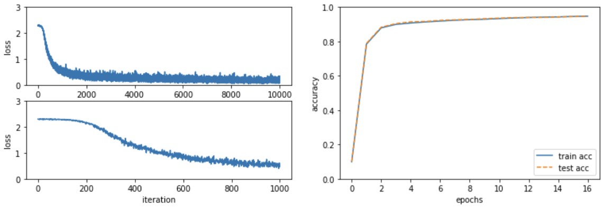

### 🔎 딥러닝 경사하강법


#### 경사법(Gradient Method)의 개념

- 신경망 기계 학습 시 최적의 매개 변수 값을 찾는데, 최적의 가중치와 편향을 찾기 위해 손실함수가 최솟값이 되는 지점을 찾아야함

- 기울기를 이용해 함수의 최솟값 또는 가능한 작은 값을 찾으려는 것이 `경사법`

- 최솟값, 최댓값을 찾느냐에 따라 경사 하강법, 경사 상승법으로 나뉘는데 경사 하강법을 더 많이 씀

- 경사법 수식

  


1) **η** (에타): **Learning rate,  학습률**
   - 한번의 학습으로 얼마만큼 학습해야할 지 (매개 변수 값을 얼마나 갱신하는 지 영향을 미침)
   - 하이퍼파라미터(hyper parameter): 학습률 같은 매개 변수를 일컫는 말, 가중치 & 편향과는 성질이 다른 매개 변수
   - 가중치, 편향 → 훈련 데이터와 학습 알고리즘에 의해 자동적으로 학습, 획득 가능
   - 학습률: 사람이 직접 설정해야 함
2) 식에서는 변수 2개인 경우로 나타냈지만 변수의 수가 늘어도 같은 식 (각 변수의 편미분) 값으로 갱신하게 됨


### 경사법의 종류

> - [참고자료 1](https://acdongpgm.tistory.com/202):    Full batch, Mini batch, SGD 설명
>
> - [참고자료 2](https://onevision.tistory.com/entry/Optimizer-%EC%9D%98-%EC%A2%85%EB%A5%98%EC%99%80-%ED%8A%B9%EC%84%B1-Momentum-RMSProp-Adam) : Optimizer 종류와 특성 


- Gradient Descent (Full batch, GD):  Batch size =m (전체), 1개의 배치만 존재하고 1 배치가 학습되어 업데이트 됨 
  - 모든 자료를 다 검토해서 최적화되는 기울기 방향을 찾음
- Mini Batch Gradient Descent: 훈련데이터에서 2진법적 접근으로 배치 사이즈를 선택하여 cost function 계산 및 경사 하강 적용
  - SGD의 노이즈를 줄이면서도 전체 배치보다는 더 빠르게 최적점을 구함
- Stochastic Gradient Descent (SGD) 확률적 경사 하강법: 확률적으로 무작위로 골라낸 미니 배치 활용
  - 예시: 100개 중 1개를 뽑아서 학습하고 갱신, 1개 뽑아서 갱신 (100회 반복)
- Momentum: 경사의 방향이 위에서 아래로 흘러가는 모습을 운동으로 표현
  - 문제점: 학습 속도가 느리며, 평탄한 지점에서 더이상 학습 불가
- Adagrad: 가중치의 업데이트 횟수에 따라 step size를 다르게 조절
  - 변화하지 않는 가중치들은 step size 크게, 변화하는 가중치들은 step size 작게
  - dL/dW: W에 대한 손실함수의 기울기
  - h: 손실함수의 기울기를 제곱하여 계속 더해준다.


### 미니 배치 학습 구현

- 훈련 데이터 중 일부를 무작위로 꺼내고, 미니 배치에 대해 경사법으로 매개변수 갱신


```python
import numpy as np
from dataset.mnist import load_mnist
from two_layer_net import TwoLayerNet

# 데이터 읽기
(x_train, t_train), (x_test, t_test) = \
    load_mnist(normalize = True, one_hot_label = True)

network = TwoLayerNet(input_size=784, hidden_size=50, output_size=10)

# 하이퍼파라미터
iters_num = 10000  # 반복 횟수를 적절히 설정한다.
train_size = x_train.shape[0]
batch_size = 100   # 미니배치 크기
learning_rate = 0.1

# 미니배치 크기를 100으로 설정. 확률적 경사 하강법을 수행해 매개변수를 갱신.
# 경사법에 의한 갱신 횟수는 10,000번으로 설정, 갱신할 때마다 손실 함수를 계산하고 그 값을 배열에 추가

train_loss_list = []
train_acc_list = []
test_acc_list = []

# 1에폭당 반복 수
iter_per_epoch = max(train_size / batch_size, 1)

for i in range(iters_num):
    # 미니배치 획득
    batch_mask = np.random.choice(train_size, batch_size)
    x_batch = x_train[batch_mask]
    t_batch = t_train[batch_mask]
    
    # 기울기 계산
    #grad = network.numerical_gradient(x_batch, t_batch)
    grad = network.gradient(x_batch, t_batch)
    
    # 매개변수 갱신
    for key in ('W1', 'b1', 'W2', 'b2'):
        network.params[key] -= learning_rate * grad[key]
    
    # 학습 경과 기록
    loss = network.loss(x_batch, t_batch)
    train_loss_list.append(loss)

    # 1에폭당 정확도 계산
    if i % iter_per_epoch == 0:
        train_acc = network.accuracy(x_train, t_train)
        test_acc = network.accuracy(x_test, t_test)
        train_acc_list.append(train_acc)
        test_acc_list.append(test_acc)
        print("train acc, test acc | " + str(train_acc) + ", " + str(test_acc))

 # 표로 손실함수 확인
import matplotlib.pyplot as plt

f, (ax1, ax2) = plt.subplots(2, 1)
x = np.array(range(iters_num))
ax1.plot(x, train_loss_list, label='loss')
ax1.set_xlabel("iteration")
ax1.set_ylabel("loss")
ax1.set_ylim(0, 3.0)
ax2.plot(x[:1000], train_loss_list[:1000], label='loss')
ax2.set_xlabel("iteration")
ax2.set_ylabel("loss")
ax2.set_ylim(0, 3.0)

# 시험 데이터 평가 그래프
# 그림 4-12 훈련 데이터와 시험 데이터에 대한 정확도 추이
markers = {'train': 'o', 'test': 's'}
x = np.arange(len(train_acc_list))
plt.plot(x, train_acc_list, label='train acc')
plt.plot(x, test_acc_list, label='test acc', linestyle='--')
plt.xlabel("epochs")
plt.ylabel("accuracy")
plt.ylim(0, 1.0)
plt.legend(loc='lower right')
plt.show()
```


- 학습 회수가 늘어나면서 손실 함수의 값이 줄어듬 → 학습이 잘 되고 있다는 뜻
- 데이터를 반복해서 학습함으로써 최적 가중치 매개변수로 서서히 다가서고 있는 것을 확인 가능





**시험 데이터로 평가하기**

- 훈련 데이터 외의 데이터를 올바르게 인식하는지 확인 필요. '오버피팅'을 일으키지 않는지 확인.
  - **오버피팅**: 훈련 데이터에 포함된 이미지만 제대로 구분. 그렇지 않은 이미지는 식별할 수 없다는 의미

- 범용 능력을 평가하기 위해 학습 도중 정기적으로 훈련 데이터와 시험 데이터를 대상으로 정확도를 기록
  - 1에폭별로 훈련 데이터와 시험 데이터에 대한 정확도를 기록
  - 에폭(epoch): 1에폭은 학습에서 훈련 데이터를 모두 소진했을 때의 회수에 해당
  - 훈련 데이터 10,000개를 100개의 미니배치로 학습할 경우, 100회가 1에폭


___


>  *"밑바닥부터 시작하는 딥러닝"*  책을 참고하며 공부하고 있습니다.