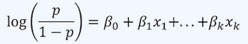
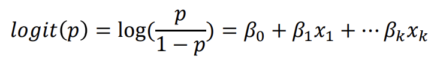
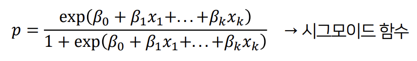
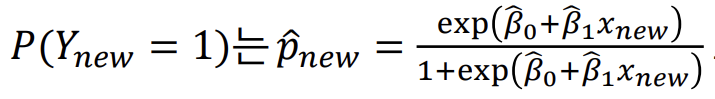

## 로지스틱 회귀모형

- 개념: 선형 회귀분석과 달리 반응 변수가 **범주형 데이터**인 경우에 사용되는 기법
- 새로운 설명변수의 값이 주어질 때 반응 변수의 각 범주에 속할 확률이 얼마인지 추정하고, 추정 확률을 분류<u>기준값(cut-off, threshold)</u> 에 따라 분류하는 목적으로 사용됨

### 이항 로지스틱 회귀모형

- 개념: 이진(0/1) 형 값을 가지는 반응 변수를 여러 설명 변수를 이용하여 회귀식의 형태로 예측하는 모형

  - 다항 로지스틱 회귀모형: 범주가 2개 이상인 경우 사용
  - **분류 알고리즘**에 해당! (회귀 알고리즘 x)

- 반응 변수 Y: 1 또는 0 값을 가지는 이진변수, 설명변수는 x1, x2,..., k개인 경우에,

  p = P(Y = 1|x1,x2, ..., xk)라고 하면,

  

- 0 <= p <= 1

- Odds(관심 사건이 발생할 확률 p) : 0에서 무한대 사이의 실수값을 가짐 -> 로그화

  - 독립변수의 범위와 확률의 범위를 맞춰주기 위해 실수 전 구간에서 값을 가지는 로그 오즈 사용

    

- 아래와 같이 시그모이드 함수로 표현할 수 있음

  

- (Xi, Yi) 의 표본자료 n개가 주어지면, 경사하강법, 최대우도추정법 등으로 가장 적합한 곡선함수(베타0 헷과 베타1 헷)을 추정, 새로운 자료 x가 주어졌을 때, y가 1일 확률 아래와 같이 추정함.

  

  

- **특징**

​	- 장점: 해석력이 직관적이다.

​    - 단점: 비선형 분리경계가 필요할 때 독립변수가 2개인 경우 1개 직선으로 표현 어려움 (예측률이 떨어짐)

​	  -예시 : XOR 게이트

​    - 비고: 주어진 훈련 자료에 대해 항상 최적의 파라미터 해를 찾을 수 있는 것은 아님 (추정 실패 가능성 有)

### 오즈비(Odds Ratio)

- X1 만 1만큼 증가하면 성공(관심범주, Y=1)에 대한 오즈가 exp(𝛽1) 배 변화함
  - **𝛽1 >0** : 관심범주에 속 할 확률이 증가함. 𝑋1 변수와 관심범주 간에는 **양의 상관관계**
  - **𝛽1<0** : 관심범주에 속 할 확률이 증가함. 𝑋1 변수와 관심범주 간에는 **음의 상관관계**