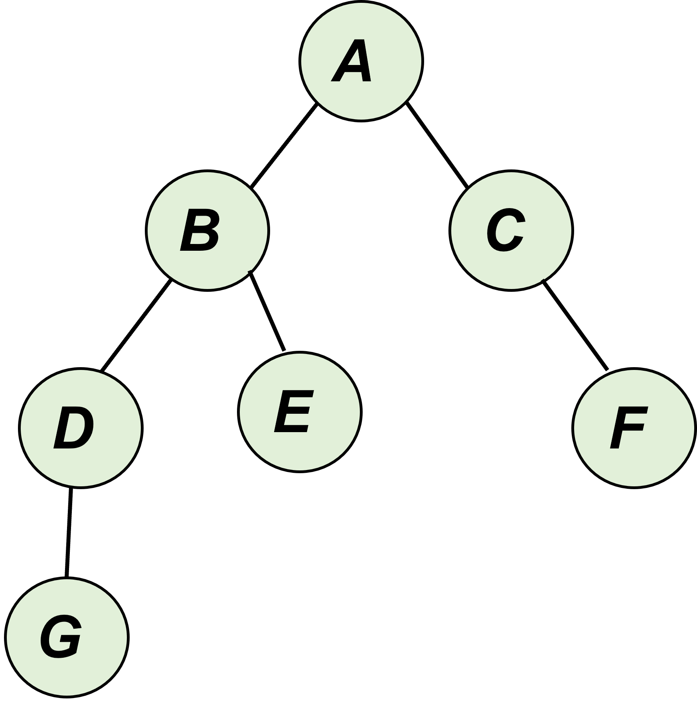
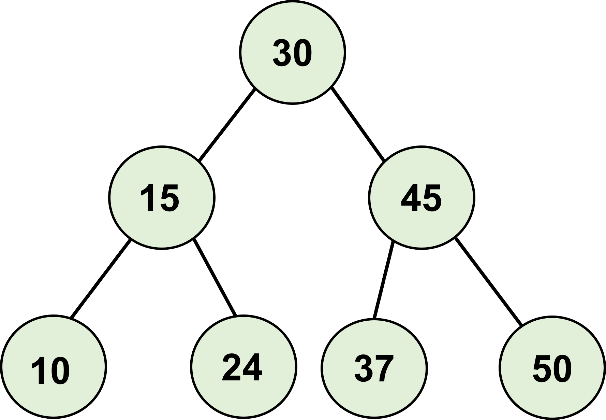
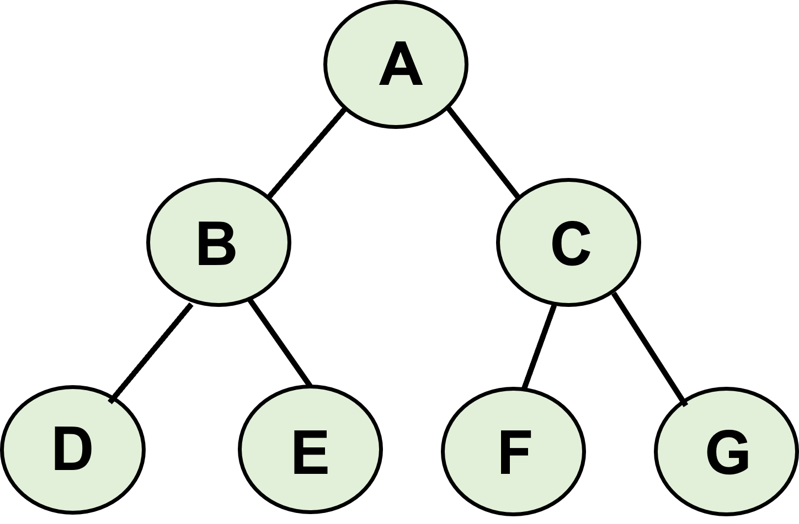

## 🌳 Tree 자료구조




- **개념:** 가계도와 같은 계층적인 구조를 표현할 때 사용할 수 있는 자료 구조

- **용어**

  - 루트 노트(root node): 부모가 없는 최상위 노드
  - 단말 노트(leaf node): 자식이 없는 최하단 노드
  - 크기(size): 트리에 포함된 모든 노드의 개수
  - 깊이(depth): 루트 노드로부터의 거리
  - 높이(height): 깊이 중 최댓값
  - 차수(degree): 각 노드의 (자식방향) 간선 개수
  - 간선: 노드 사이를 연결하는 선

  

- 기본적으로 트리의 크기가 N일 때, 전체 간선의 개수는 N-1


### 이진 탐색 트리 (Binary Search Tree)

: 이진 탐색이 동작할 수 있도록 고안된 효율적인 탐색이 가능한 자료 구조의 일종

- 특징

  - 부모 노드 > 왼쪽 자식 노드
  - 부모 노드 < 오른쪽 자식 노드





- 조회 방법: 위 특징을 활용하여 up, down 게임과 같이 선택
  - ex. -0. 현재 노드와 찾는 원소 37을 비교
  - ex. -1. 찾는 원소가 더 작으면 왼쪽 방문
  - ex. -2. 찾는 원소가 크면 오른쪽 방문


### 트리 구조 코드 구현

- 순회 방법 

  1) 루트 먼저 방문하고 다른 노드 방문: 전위 순회

  2) 왼쪽 자식 노드부터 먼저 방문한 뒤 루트 방문: 중위 순회

  3) 오른쪽 자식 노드부터 먼저 방문한 뒤 가장 마지막에  루트 방문: 후위 순회

     




- 입력 값 (예시)

> 7
> A B C
> B D E
> C F G
> D None None
> E None None
> F None None
> G None None


```python
class Node:
    def __init__(self, data, left_node, right_node):
        self.data = data
        self.left_node = left_node
        self.right_node = right_node
    
# 전위 순회 (Preorder Traversal)
def pre_order(node):
    print(node.data, end=' ')
    if node.left_node != None:
        pre_order(tree[node.left_node])
    if node.right_node != None:
        pre_order(tree[node.right_node])

# 중위 순회 (Inorder Traversal)
def in_order(node):
    if node.left_node != None:
        in_order(tree[node.left_node])
    print(node.data, end=' ')
    if node.right_node != None:
        in_order(tree[node.right_node])

# 후위 순회 (Postorder Traversal)
def post_order(node):
    if node.left_node != None:
        post_order(tree[node.left_node])
    if node.right_node != None:
        post_order(tree[node.right_node])
    print(node.data, end=' ')

n = int(input())
tree = {}

for i in range(n):
    data, left_node, right_node = input().split()
    if left_node == 'None':
        left_node = None
    if right_node == 'None':
        right_node = None
    tree[data] = Node(data, left_node, right_node)

pre_order(tree['A'])
print()
in_order(tree['A'])
print()
post_order(tree['A'])

>>>
# A B D E C F G
# D B E A F C G
# D E B F G C A
```


