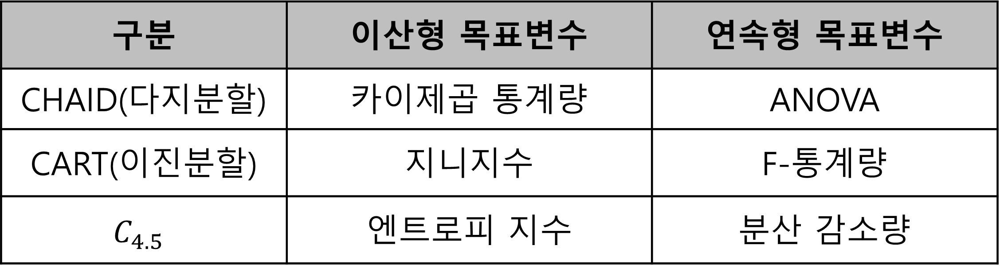

## Decision Tree Analysis

- 개념: 의사결정 구조를 나무 모형으로 나타내고, 전체 자료를  몇개의 소집단으로 분류하거나 예측을 수행하는데 사용되는 기법
- 용어: 대개 `트리형 자료 구조`에서 나왔던 의미와 같다.
  - 상위 마디: 부모 마디
  - 하위 마디: 자식 마디
  - 뿌리 마디: 의사결정나무가 시작되는 마디
  - 최종 마디: 더 이상 분기 되지 않는 마디
  - 중간 마디: 의사결정 나무의 중간에 있는 마디
- 예시: 기업의 부도 예측, 주가 상한가 종목 예측, 환율 예측 등

- 의사결정나무 분석 모형의 **장단점**
  - 장점
    - 단순하여 해석이 용이하다.
    - 상호작용 효과: 유용한 입력변수의 파악과 예측변수 간의 상호작용 및 비선형성을 고려하여 분석이 수행됨
    - 비모수적 모형
  - 단점
    - 비안정성: 분류 기준 값의 경계선 근방의 자료값에 대해 오차가 클 수 있다.
    - 예측의 어려움: 로지스틱 회귀분석과 같이 예측변수의 효과를 파악하기 어려워 새로운 자료에 대한 예측이 어렵다.

- 분석과정
  1) 목표변수와 관련되어 있다고 판단되는 설명 변수를 선택
  2) 분석목적과 자료형태에 따라 분리기준과 정지규칙을 정해서 의사결정나무를 생성
  3) 부적절한 나뭇가지는 제거
  4) 이익, 위험, 비용을 고려하여 모형에 대한 타당성 평가
  5) 분류 및 예측

### 의사결정나무 알고리즘 분류

- 불순도(impurity): 서로 다른 특징을 가진 값이 분포하는 정도 ↔ 순도
- 엔트로피(Entropy): 불순도를 수치화한 지표 중 하나, 정보량의 기댓값
- 지니지수(Gini Index): 

1. **CHAID(Chi-squared Automatic Interaction Detection)**

   : 카이제곱(이산형 목표변수)이나 F검정(연속형 목표변수) 을 이용해 분리를 순행하는 알고리즘

   카이제곱 통계량: 기대도수와 관측도수의 차이를 이용한 값이므로 차이가 커질수록 순수도는 높아지고,

   좋은 분리가 되었다고 할 수 있으며, 제일 큰 예측변수를 이용하여 자식마디를 형성

2. **CART(Classification and Regression Tree)**

​     : 지니계수 (Gini Index)를 이용해서 분리를 수행하는 알고리즘, 지니점수(지수값) 0~1 사이로 1은 완벽한 순수의 노드를 나타낸다. 지니지수는 각 마디에서 불순도나 다양도를 측정함

