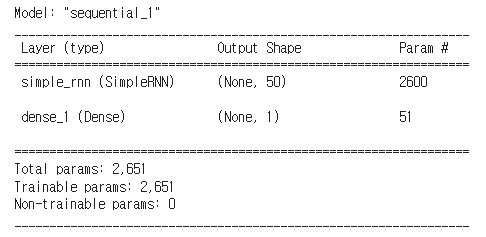

## 👀 RNN 종류와 코드 구현

- 종류
 1. One-to-Many (일대다): 1개의 이미지 입력에 대해 사진의 제목을 출력하는 이미지 캡셔닝 등에 사용 
 2. Many-to-One (다대일): 스팸 메일 분류, 텍스트 분류 등에 활용
 3. Many-to-Many (다대다): 챗봇, 번역기, 개체인식, 태깅작업 등에 활용


**TensorFlow로 구현해보면,**

   - 주의사항:

     - Input_dim, shape 주의 (dim, size가 맞지 않으면 모델링도 잘못되고, 에러남)

     - 음수형 데이터나 범위가 너무 큰 데이터의 경우, Scaler를 통한 데이터 전처리 권장

       (MinMaxScaler, Standard Scaler 등)

     - 모델 훈련 후 예측하여 결과를 확인할 때 Scale 원복하여 확인 (`scaler.inverse_transform(data)`)

       

   - Cosine Wave로 값을 예측해보기

     ```python
     # 1. cosine wave 만들기
     import pandas as pd
     import numpy as np
     import matplotlib.pyplot as plt
     
     x = np.linspace(1, 100, 1001)
     x = np.round(x, 1)
     y = np.cos(x)
     # plt.plot(x, y) 그래프 시각화
     
     # 2. 데이터프레임화, 데이터셋 나누기
     df = pd.DataFrame(data=y, index=x, columns=["cosine_wave"])
     train = df.iloc[:801]
     test = df.iloc[801:]
     
     # 음수 조정을 위해 MinMax Scaler 활용
     from sklearn.preprocessing import MinMaxScaler
     scaler = MinMaxScaler()
     scaler.fit(train)
     s_train = scaler.transform(train)
     # s_test = scaler.transform(test)
     
     # batch dataset 과 shape 통일 시키기
     batch = s_test[-length:]
     c_batch = batch.reshape((1, length, 1))
     
     # TimeSeries Generator
     # batch_size = 이동간격, 폭
     
     from tensorflow.keras.preprocessing.sequence import TimeseriesGenerator
     
     length = 50
     generator = TimeseriesGenerator(s_train, s_train, length=length, batch_size=c_batch)
     
     # 모델 생성
     model = tf.keras.models.Sequential()
     model.add(tf.keras.layers.SimpleRNN(50, input_shape=(50,1)))
     model.add(tf.keras.layers.Dense(1))
     model.summary()
     ```

     

