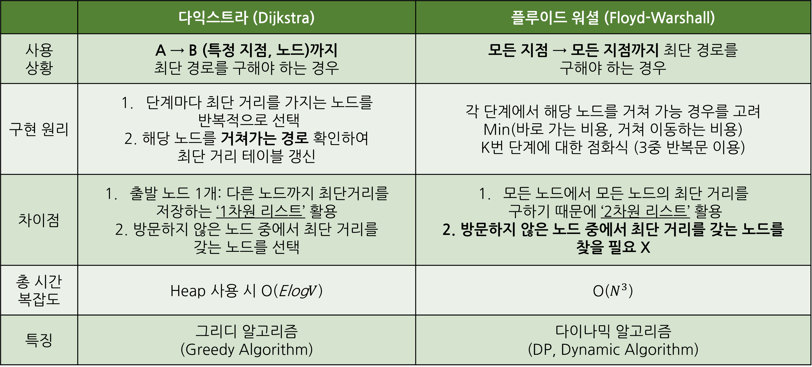

### 🚩 최단 경로 알고리즘2 - "플루이드 워셜 알고리즘"

___

지난번 최단 경로 알고리즘으로 정리했던 ['다익스트라 알고리즘](Day_0528.md)'에 이어 

플루이드 워셜 알고리즘에 대해 비교하여 정리해보면 다음과 같다.

아직 다익스트라는 많이 안 풀어봐서 복습하면서 원리를 더 익혀봐야겠다.





**<heap 사용 다익스트라 코드>**

```python
import heapq
import sys
input = sys.stdin.realine
INF = int(1e9) # 무한대값 10억 설정

# 노드 수, 간선 개수 입력 받기
n, m = map(int, input().split())

# 시작 노드 번호 입력 받기
start = int(input())

# 노드 정보 받기
graph = [[] for i in range(n+1)]

for _ in range(m):
    a, b, c = map(int, input().split())
    graph[a].append((b, c))

def dijkstra(start):
    q = []
    # 시작 노드로 가기 위한 최단 경로 0으로 설정하여 큐에 넣기
    heapq.push(q, (0, start))
    distance[start] = 0
    while q:
        # 가장 거리가 짧은 노드에 대한 정보 꺼내기
        dist, now = heapq.heappop(q)
        # 현재 노드가 이미 처리 되었다면 무시
        if distance[now] < dist:
            continue
        # 현재 노드와 연결된 다른 인접한 노드 확인
        for i in graph[now]:
            cost = dist + i[1]
            
        # 현재 노드 거쳐서 다른 노드로 이동하는 거리가 더 짧은 경우
    	if cost < distance[i[0]]
        	distance[i[0]] = cost
            heapq.heappush(q, (cost, i[0]))
       
    # 함수 수행
    dijkstra(start)
    
    # 모든 노드로 가기 위한 최단 거리 출력
    for i in range(1, n+1):
        # 도달 할 수 없을 때 INF 출력
        if distance[i] == INF:
            print("INFINITY")
        else:
            print(distance[i])
        
```


**<플루이드 워셜 코드>** BOJ 1389번 풀이

```python
# Kevin's Bacon (132ms)
import sys
read = sys.stdin.readline
INF = int(1e9) # 무한대를 10억으로 정의
N, M = map(int, input().split())

graph = [[INF]*(N+1)  for _ in range(N+1)] # 그래프 표현


for _ in range(M):
  a, b = map(int, read().split())

  # 노드 연결 하기
  graph[a][b] = 1
  graph[b][a] = 1

# print(graph)

# 자기 자신으로 가는 비용 초기화
for i in range(1, N+1):
    for j in range(1, N+1):
        if i == j:
            graph[i][j] = 0

# 플루이드 워셜 알고리즘 수행
for k in range(1, N+1):
    for i in range(1, N+1):
        for j in range(1, N+1):
            graph[i][j] = min(graph[i][j], graph[i][k] + graph[k][j]) 
            # 둘 중 최솟값으로 업데이트

bacons = []
for i in range(1, N+1):
    # 번호별 친구 관계 다 더한게 베이컨이므로 sum하여 추가
    bacons.append(sum(graph[i][1:])) 
# print(bacons) # [6, 8, 5, 5, 8]

# 베이컨 수가 가장 적은 사람이면서 여러 명일 때는 앞 번호니까 index 함수 활용
print(bacons.index(min(bacons)) + 1) 
```

